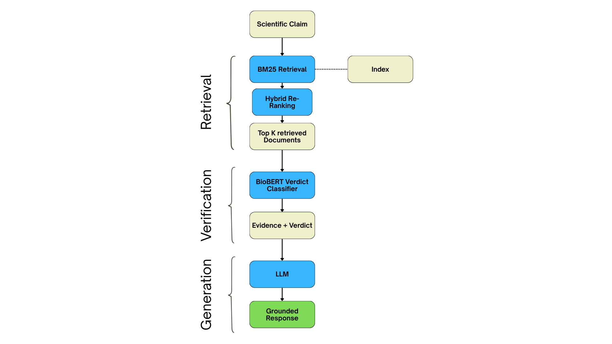

# SciVerify — Scientific Claim Verification using RAG

A retrieval-augmented pipeline for verifying scientific claims against evidence from the SciFact scientific literature corpus.

[Overview] • [Architecture] • [Experiments] • [Results]

---

## Overview

Scientific literature contains a rapidly growing amount of information, making it
difficult to efficiently determine whether a scientific claim is supported or
contradicted by existing evidence.

**SciVerify** is a scientific claim verification system built on the **SciFact**
benchmark. Given a scientific claim, the system retrieves relevant scientific
documents,re-ranks them for better lexical relevance and determines whether the
retrieved evidence supports or contradicts the claim, and generates a 
grounded explanation using retrieval-augmented generation with explicit citation.

The pipeline combines:

- **BM25** for scientific evidence retrieval
- **Query expansion** experiments for improving retrieval
- **Hybrid cross-encoder re-ranking** that combines normalized BM25 and cross-encoder relevance scores to refine the ranking of candidate documents while preserving lexical relevance
- **SciBERT** to classify each retrieved document as supporting or contradicting the claim
- **RAG/LLM-based generation** for producing evidence-grounded explanations with explicit citations to the retrieved documents
- Retrieval and verification evaluation through quantitative metrics and ablation studies

---

## Architecture
SciVerify follows a three-stage pipeline consisting of evidence retrieval,
claim-evidence verification, and grounded response generation.

## Experiments

### Query Expansion

To investigate whether pseudo-relevance feedback could improve scientific
evidence retrieval, two query expansion strategies were evaluated:

- **PRF with KL divergence**
- **RM3 (Relevance Model 3)**

Both approaches were evaluated against the same BM25 retrieval baseline using
Recall, Mean Reciprocal Rank (MRR), and Normalized Discounted Cumulative Gain
(NDCG) at multiple retrieval depths.

### Recall

| PRF with KL |  |  |  |  |  |  |
|---|---:|---:|---:|---:|---:|---:|
| Method | R@3 | R@5 | R@7 | R@10 | R@20 | R@50 |
| BM25 | 0.6861 | 0.7469 | 0.7812 | 0.8128 | 0.8517 | 0.8841 |
| BM25 + QE | 0.5372 | 0.6758 | 0.7239 | 0.7842 | 0.8459 | 0.8799 |
| BM25 + QE + Reranking | 0.6490 | 0.7124 | 0.7648 | 0.7929 | 0.8521 | 0.8799 |
| BM25 + Reranking | **0.7278** | **0.7697** | **0.7988** | **0.8387** | **0.8691** | **0.8841** |

| RM3 |  |  |  |  |  |  |
|---|---:|---:|---:|---:|---:|---:|
| Method | R@3 | R@5 | R@7 | R@10 | R@20 | R@50 |
| BM25 | 0.6861 | 0.7469 | 0.7812 | 0.8128 | 0.8517 | 0.8841 |
| BM25 + QE | 0.6503 | 0.7278 | 0.7636 | 0.8136 | 0.8432 | 0.8767 |
| BM25 + QE + Reranking | 0.6689 | 0.7359 | 0.7717 | 0.8049 | 0.8560 | 0.8767 |
| BM25 + Reranking | **0.7278** | **0.7697** | **0.7988** | **0.8387** | **0.8691** | **0.8841** |

### MRR

| PRF with KL |  |  |  |  |  |  |
|---|---:|---:|---:|---:|---:|---:|
| Method | MRR@3 | MRR@5 | MRR@7 | MRR@10 | MRR@20 | MRR@50 |
| BM25 | 0.6111 | 0.6253 | 0.6308 | 0.6338 | 0.6364 | 0.6372 |
| BM25 + QE | 0.3944 | 0.4271 | 0.4344 | 0.4409 | 0.4448 | 0.4457 |
| BM25 + QE + Reranking | 0.5150 | 0.5280 | 0.5352 | 0.7538 | 0.5423 | 0.5432 |
| BM25 + Reranking | **0.6556** | **0.6646** | **0.6693** | **0.6741** | **0.6759** | **0.6763** |

| RM3 |  |  |  |  |  |  |
|---|---:|---:|---:|---:|---:|---:|
| Method | MRR@3 | MRR@5 | MRR@7 | MRR@10 | MRR@20 | MRR@50 |
| BM25 | 0.6111 | 0.6253 | 0.6308 | 0.6338 | 0.6364 | 0.6372 |
| BM25 + QE | 0.5956 | 0.6119 | 0.6172 | 0.6226 | 0.6245 | 0.6256 |
| BM25 + QE + Reranking | 0.6061 | 0.6194 | 0.6251 | 0.6290 | 0.6326 | 0.6334 |
| BM25 + Reranking | **0.6556** | **0.6646** | **0.6693** | **0.6741** | **0.6759** | **0.6763** |

### NDCG

| PRF with KL |  |  |  |  |  |  |
|---|---:|---:|---:|---:|---:|---:|
| Method | NDCG@3 | NDCG@5 | NDCG@7 | NDCG@10 | NDCG@20 | NDCG@50 |
| BM25 | 0.6245 | 0.6503 | 0.6630 | 0.6736 | 0.6841 | 0.6913 |
| BM25 + Query Expansion | 0.4268 | 0.4852 | 0.5031 | 0.5221 | 0.5387 | 0.5456 |
| BM25 + Query Expansion + Reranking | 0.5418 | 0.5683 | 0.5881 | 0.5975 | 0.6133 | 0.6189 |
| **BM25 + Reranking** | **0.6690** | **0.6865** | **0.6979** | **0.7111** | **0.7194** | **0.7228** |

| RM3 |  |  |  |  |  |  |
|---|---:|---:|---:|---:|---:|---:|
| Method | NDCG@3 | NDCG@5 | NDCG@7 | NDCG@10 | NDCG@20 | NDCG@50 |
| BM25 | 0.6245 | 0.6503 | 0.6630 | 0.6736 | 0.6841 | 0.6913 |
| BM25 + Query Expansion | 0.6057 | 0.6376 | 0.6511 | 0.6670 | 0.6746 | 0.6822 |
| BM25 + Query Expansion + Reranking | 0.6182 | 0.6470 | 0.6607 | 0.6715 | 0.6854 | 0.6897 |
| **BM25 + Reranking** | **0.6690** | **0.6865** | **0.6979** | **0.7111** | **0.7194** | **0.7228** |

## Results

The final pipeline was evaluated end-to-end on scientific claims from the
SciFact benchmark. For each claim, SciVerify retrieves relevant scientific
documents, re-ranks the candidates, predicts a claim-document verdict, and
uses the retrieved evidence and verdicts to generate a grounded explanation.

Representative outputs from the final pipeline are available in
[`final_outputs.txt`](final_outputs.txt).

### Example

**Claim:**  
> ADAR1 binds to Dicer to cleave pre-miRNA.

**Retrieved evidence and verdicts:**

| Document | Verdict | Support Probability |
|---|---|---:|
| ADAR1 Forms a Complex with Dicer... | SUPPORT | 0.6795 |
| ... | SUPPORT | 0.6168 |
| ... | ... | ... |

The final LLM response synthesizes the retrieved evidence and explicitly
references the source documents used to support its explanation.

> **Example generated response:**  
> The retrieved evidence supports the claim that ADAR1 interacts with Dicer
> in the context of pre-miRNA processing, with the relevant evidence coming
> from the retrieved scientific abstracts. [Document 1]

### End-to-End Output

The complete outputs generated by the final pipeline, including retrieved
documents, verdict probabilities, and grounded responses, can be found in
[`final_outputs.txt`](final_outputs.txt).
